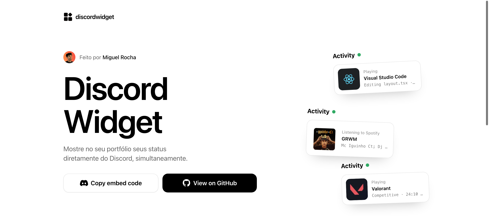

# Discord Widget

Show who's online on your Discord server, live, anywhere you can paste a line of code.

Built with Next.js 14 (App Router), React 18 and TypeScript, styled with Tailwind CSS.

## About

Hi, I'm **Miguel Rocha**, a software engineer who built this project out of a feature from my own portfolio, made with **OpenPortfolios by @MatheusAudibert**.

The project uses Discord activity status through the **Lanyard library/API**. The site walks you through a step-by-step generator that gives you a ready-to-paste component with your own Discord user ID and theme already configured, so you can drop it straight into your own projects.

#### Support
If you're using this repo, feel free to show support and give this repo a ⭐ star! It means a lot, thank you :)
